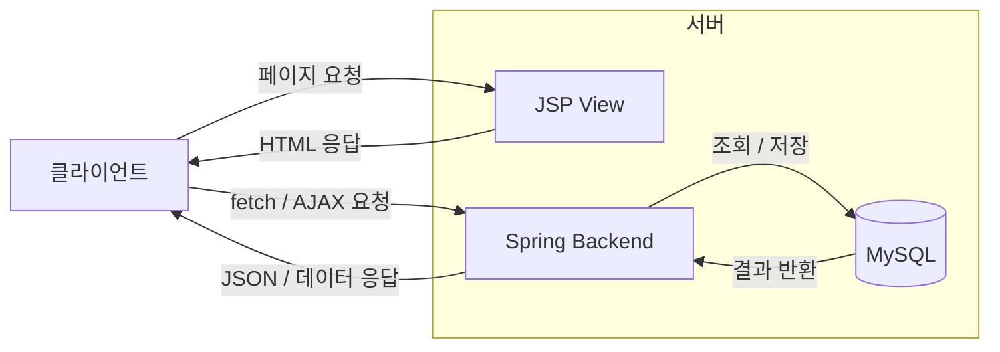
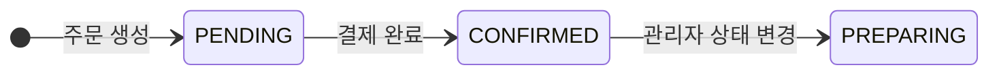

## 📌 상품 주문 관리 시스템

해당 프로젝트는 Spring Security 기반의 세션 인증·인가를 적용해 사용자와 관리자의 권한을 분리한 상품·주문 관리 웹 애플리케이션입니다.

---
## 📝 프로젝트 소개
사용자는 상품 목록과 상세 정보를 조회하고, 원하는 상품을 장바구니에 담아 주문까지 진행할 수 있습니다.  
또한 모의 결제 기능을 통해 주문 상태 변경과 재고 반영이 이루어지도록 구현했습니다.  
관리자는 관리자 전용 기능에서 상품을 등록·수정·삭제하며상품 정보를 관리할 수 있도록 구성했습니다. <br>

  
### V2
- JSP + Fetch API를 통한 CSR 구조 리팩토링 중



---

## 💻 기술 스택

Java, Spring Boot, Spring MVC, Spring Security, MyBatis, MySQL, JSP, JSTL
  
### 기술 사용 이유

| 기술 | 사용 이유 |
| --- | --- |
| Spring Boot |	프로젝트 목적에 집중하고 반복적인 설정 부담을 줄여 빠르게 개발 환경을 구성하기 위해 사용 |
| Spring MVC + JSP | 기존 REST API 중심 프로젝트 경험에서 확장해, 뷰 반환 흐름과 SSR 구조를 직접 구현하며 이해를 넓히고자 적용 |
| MyBatis |	SQL을 직접 작성하며 데이터 처리 과정을 명확히 이해하고, 동적 쿼리로 다양한 조회 조건에 유연하게 대응하기 위해 선택 |
---

## 🔄 플로우차트
### 사용자 흐름

```mermaid
flowchart TD
  A[비회원] --> B[회원가입 / 로그인]
  B --> C[USER]
  B --> D[ADMIN]

  C --> E[상품 목록 조회]
  C --> F[상품 상세 조회]
  F --> G[장바구니 담기]
  G --> H[장바구니 조회 / 수정 / 삭제]
  H --> I[주문 생성]
  I --> J[주문 상세 조회]
  J --> K[모의 결제]

  D --> L[상품 관리]
  L --> M[상품 등록 / 수정 / 삭제]

  D --> N[주문 관리]
  N --> O[주문 목록 조회]
  O --> P[주문 상태 변경]
```



### 주문 상태 변이


---

## 🧩 ERD


---

## 🗂️ 프로젝트 구조
```
src/main/java/com/lumiera/shop/lumierashop
├── controller
├── domain
│   └── enums
├── dto
│   ├── request
│   └── response
├── global
│   ├── annotation
│   ├── common
│   │   └── pagination
│   ├── error
│   │   ├── code
│   │   └── exception
│   └── security
├── mapper
└── service
```

---

## ✨ 주요 기능
### 👤 인증 / 회원 관리

- 회원가입 및 로그인 기능 구현
- 로그인/로그아웃은 Spring Security 세션 기반으로 처리
- 아이디/비밀번호 유효성 검증 적용
- 아이디 중복 확인 및 비밀번호 확인 검증 적용

### 🛍️ 상품 조회

- 전체 사용자는 상품 목록과 상세 정보를 조회 가능
- 사용자 화면에서는 삭제되지 않은 상품만 조회 가능
- 상품 목록 조회 시 키워드 검색, 카테고리 필터링, 페이징 지원

### 🛒 장바구니

- 로그인한 사용자는 상품을 장바구니에 추가 가능
- 동일 상품 재추가 시 수량이 누적되도록 처리
- 장바구니에서 상품 수량 변경 및 제거 가능
- 장바구니 추가/수정 시 재고 수량 초과 여부 검증

### 📦 주문

- 로그인한 사용자는 장바구니에서 선택한 상품으로 주문 생성 가능
- 주문 목록 조회 및 주문 상세 조회 가능
- 장바구니 상품 정보를 기반으로 총 주문 금액 계산
- 주문 상태가 PENDING일 때 모의 결제 가능

### 🛠️ 관리자 상품 관리

- 관리자는 상품 등록, 수정, 삭제 가능
- 관리자 화면에서는 삭제된 상품을 포함한 모든 상품 조회 가능
- 상품 등록 시 대표 이미지와 상세 이미지를 함께 저장
- 상품 수정 시 대표 이미지 변경 및 상세 이미지 교체 가능
- 상품 삭제는 Soft Delete 방식 적용

### 📋 관리자 주문 관리

- 관리자는 주문 목록 및 주문 상세 조회 가능
- 주문 기간, 상태, 주문자 기준 검색 지원
- 주문 상태를 일괄로 PENDING → PREPARING 상태로 변경 가능

---

## 🔐 권한 정책
- **USER** : 로그인한 일반 사용자
- **ADMIN** : 관리자 권한 사용자

Spring Security 설정과 `@PreAuthorize`, `sec:authorize` 태그를 사용해 역할별 접근 제어를 적용했습니다.

USER 중심 기능 : `/products`, `/cart`, `/orders`    
ADMIN 전용 기능 : `/admin/products`, `/admin/orders`

---

## 🛠️ 트러블슈팅
- [주문 생성 시 부분 저장으로 인한 데이터 불일치를 트랜잭션으로 해결](docs/troubleshooting/transaction.md)
- [조건부 UPDATE를 활용한 주문 중복 처리 방지](docs/troubleshooting/concurrency.md)
- [Spring Security 설정 순서로 인해 권한 없는 사용자가 화면에 접근 가능했던 문제](docs/troubleshooting/security-requestmatcher-order.md)

<details>
<summary>기타 트러블슈팅 보기</summary>

- [JSP form:form 바인딩 기준을 잘못 이해해 path 지정이 잘못된 문제](docs/troubleshooting/jsp-form-path-binding.md)
- [MyBatis resultMap 매핑으로 조회 결과가 1건만 반환되던 문제](docs/troubleshooting/mybatis-resultmap-duplicate-merge.md)
- [리다이렉트 시 Model 값 유실 문제](docs/troubleshooting/redirectattributes-flash.md)
- [상품 수정 시 빈 파일 리스트가 전달되어 이미지 변경 로직이 오동작한 문제](docs/troubleshooting/multipartfile-empty-list.md)

</details>

---

## 📝 회고

### 공용 JSP와 컨트롤러 책임 분리를 다시 설계한 경험

초기에는 공용 JSP를 사용하면 컨트롤러도 하나로 통합해야 한다고 생각해 권한별 로직을 하나의 컨트롤러에 함께 작성했습니다.  
그 결과 중복 메서드가 늘어나고 책임이 모호해졌습니다.  
이후 공용 JSP는 유지하되 컨트롤러와 로직은 역할에 따라 분리하고, JSP에서는 권한에 따라 URL만 분기하도록 구조를 개선했습니다.  
이 경험을 통해 화면 재사용과 책임 분리는 별개의 문제이며, 같은 화면을 사용하더라도 역할에 따라 URL과 컨트롤러를 분리할 수 있다는 점을 배웠습니다.
