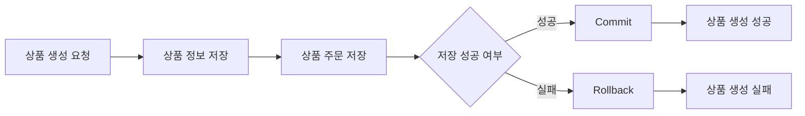

## 주문 생성 시 부분 저장으로 인한 데이터 불일치를 트랜잭션으로 해결

### 문제
초기에는 주문 정보와 주문 상품 정보를 각각 저장하도록 구현해, 중간에 예외가 발생하면 주문만 생성되고  
주문 상품은 저장되지 않는 부분 저장 문제가 발생했습니다.  
그 결과 주문 목록에서는 조회되지만, 주문 상세 조회 시 연결된 주문 상품 정보가 없어 예외가 발생했습니다.

### 해결
누락된 주문 상품 정보가 있어도 상세 조회가 가능하도록 조회 쿼리를 `JOIN`에서 `LEFT JOIN`으로 변경했습니다.  
이후 근본 원인을 해결하기 위해 주문 생성 로직에서 주문과 주문 상품 저장을 하나의 트랜잭션으로 묶어,  
중간에 오류가 발생하면 모든 작업이 롤백 되도록 수정했습니다.

### 결과
주문 생성 중 오류가 발생해도 주문과 주문 상품 간 데이터 불일치가 남지 않도록 개선하고,  
기존 누락 데이터로 인해 발생하던 주문 상세 조회 예외를 방지해 조회 안정성을 높였습니다.
